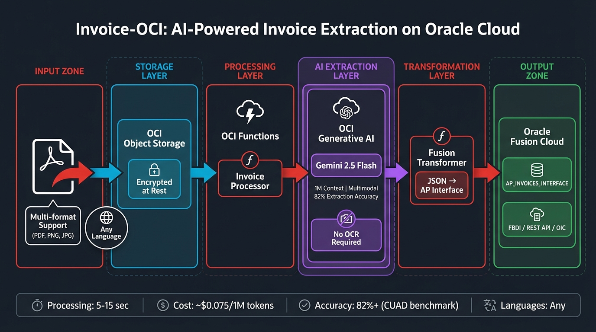

# Invoice-OCI

> **AI-Powered Invoice Extraction on Oracle Cloud Infrastructure**

[](LICENSE)
[](https://docs.oracle.com/en-us/iaas/Content/generative-ai/home.htm)
[]()

---

## Architecture

<p align="center">
  
</p>

```
PDF Invoice → OCI Object Storage → OCI GenAI (Gemini 2.5) → JSON → Oracle Fusion AP
```

---

## Why OCI Generative AI for Invoice Extraction?

### Technical Rationale

**Gemini 2.5 Flash** is selected for this architecture based on enterprise benchmarks:

| Capability | Specification | Source |
|------------|---------------|--------|
| **Extraction Accuracy** | 82% on hard extraction tasks | [Box AI CUAD Benchmark](https://blog.box.com/gemini-25-flash-delivers-enhanced-document-qa-and-extraction-box-ai) |
| **Document Q&A Recall** | 80% single-doc, 79% multi-doc | Box AI Enterprise Evaluation |
| **Context Window** | 1M tokens | Native support for large documents |
| **Multimodal Input** | PDF, images, scans - no OCR step | Direct document understanding |
| **Processing Speed** | 5-15 seconds per invoice | Optimized for throughput |

**Key Architectural Advantages:**

1. **No OCR Pipeline Required** - Gemini 2.5 Flash processes PDFs natively through multimodal understanding, eliminating OCR preprocessing errors and complexity

2. **Multi-Column & Complex Layout Handling** - Handles headers, tables, footnotes, charts, and mixed text-image blocks without manual configuration

3. **Language Agnostic** - Extracts invoices in any language without language-specific models or preprocessing

4. **Enterprise Validation** - Moody's production systems achieve 95%+ accuracy with Gemini for complex PDF extraction

### For Oracle Fusion Customers

| Benefit | Description |
|---------|-------------|
| **Native Output Format** | Direct AP_INVOICES_INTERFACE structure |
| **Single Cloud Environment** | No multi-cloud data movement |
| **OCI Security Model** | IAM policies, encryption at rest, audit logging |
| **Serverless Scale** | OCI Functions - pay per invocation |

---

## OCI Services Used

| Component | OCI Service | Purpose |
|-----------|-------------|---------|
| **Storage** | Object Storage | Invoice PDFs, extracted JSON |
| **AI Extraction** | OCI Generative AI | Gemini 2.5 Flash multimodal inference |
| **Compute** | OCI Functions | Serverless processing |
| **Infrastructure** | Terraform | Reproducible deployment |

---

## Pricing

> **Source:** [Oracle Cloud Price List](https://www.oracle.com/cloud/price-list/) | Verified: 2026-02-03

| Model | Input (per 1M tokens) | Output (per 1M tokens) | Best For |
|-------|----------------------|------------------------|----------|
| **Gemini 2.5 Flash** | $0.075 | $0.30 | Standard invoices (recommended) |
| Gemini 2.5 Flash-Lite | $0.0375 | $0.15 | High volume, simpler formats |
| Gemini 2.5 Pro | $0.075-0.30 | $0.30-1.20 | Complex multi-page documents |

### Estimated Cost per Invoice

| Invoice Complexity | Tokens (approx.) | Cost |
|-------------------|------------------|------|
| Simple (1 page) | ~1,500 input, ~400 output | ~$0.0002 |
| Standard (2-3 pages) | ~3,000 input, ~600 output | ~$0.0004 |
| Complex (5+ pages) | ~8,000 input, ~1,000 output | ~$0.0009 |

*1,000 standard invoices ≈ $0.40 in AI inference costs*

---

## Extracted Data Schema

```json
{
  "vendor": {
    "name": "Acme Supplies Ltd",
    "address": "123 Business Park, London EC1A 1BB",
    "tax_id": "GB123456789",
    "phone": "+44 20 7946 0958",
    "email": "billing@acme-supplies.co.uk"
  },
  "invoice_details": {
    "number": "INV-2026-0142",
    "date": "2026-01-15",
    "due_date": "2026-02-14",
    "po_number": "PO-8847",
    "payment_terms": "Net 30"
  },
  "bill_to": {
    "name": "Customer Corp",
    "address": "456 Corporate Drive"
  },
  "line_items": [
    {
      "description": "Professional Services - January",
      "quantity": 40,
      "unit_price": 150.00,
      "amount": 6000.00
    }
  ],
  "totals": {
    "subtotal": 6000.00,
    "tax_rate": "20%",
    "tax_amount": 1200.00,
    "total": 7200.00,
    "currency": "GBP"
  },
  "metadata": {
    "language": "English",
    "confidence": "HIGH",
    "extraction_model": "gemini-2.5-flash"
  }
}
```

---

## Oracle Fusion Integration

Output transforms directly to **AP_INVOICES_INTERFACE** format:

```json
{
  "InvoiceNum": "INV-2026-0142",
  "InvoiceDate": "2026-01-15",
  "VendorName": "Acme Supplies Ltd",
  "VendorTaxRegistrationNumber": "GB123456789",
  "InvoiceAmount": 7200.00,
  "InvoiceCurrencyCode": "GBP",
  "TermsName": "Net 30",
  "PoNumber": "PO-8847",
  "Source": "INVOICE_OCI",
  "invoiceLinesCollection": [
    {
      "LineNumber": 1,
      "LineType": "ITEM",
      "Description": "Professional Services - January",
      "Quantity": 40,
      "UnitPrice": 150.00,
      "Amount": 6000.00
    },
    {
      "LineNumber": 2,
      "LineType": "TAX",
      "Description": "VAT 20%",
      "Amount": 1200.00
    }
  ]
}
```

### Import Methods

| Method | Use Case | Documentation |
|--------|----------|---------------|
| **FBDI** | Batch import | [File-Based Data Import](https://docs.oracle.com/en/cloud/saas/financials/24d/oefbf/) |
| **REST API** | Real-time integration | [Fusion REST APIs](https://docs.oracle.com/en/cloud/saas/financials/24d/farfa/) |
| **OIC** | Orchestrated workflows | [Oracle Integration Cloud](https://docs.oracle.com/en/cloud/paas/integration-cloud/) |

---

## Deployment

### Prerequisites

- OCI Tenancy with Generative AI enabled
- Compartment with appropriate policies
- OCI CLI configured
- Terraform >= 1.5
- Fn Project CLI

### Quick Start

```bash
# Clone
git clone https://github.com/oci-ai-architects/invoice-oci.git
cd invoice-oci

# Configure infrastructure
cd infrastructure/terraform
cp example.tfvars dev.tfvars
# Edit dev.tfvars with your OCIDs

# Deploy
terraform init
terraform apply -var-file="dev.tfvars"

# Deploy functions
cd ../../functions
fn deploy --app invoice-oci-app --all
```

### Required IAM Policies

```
Allow dynamic-group invoice-oci-functions to manage objects in compartment <name>
Allow dynamic-group invoice-oci-functions to use generative-ai-inference in compartment <name>
```

---

## Project Status

| Component | Status | Notes |
|-----------|--------|-------|
| Architecture | ✅ Designed | Production patterns |
| Terraform | ✅ Complete | Single-compartment |
| Invoice Processor | ✅ Complete | Gemini 2.5 Flash |
| Fusion Transformer | ✅ Complete | AP_INVOICES_INTERFACE |
| Testing | ⚠️ Reference | Requires your invoice formats |

**This is a reference architecture.** Production deployment requires:
- Security review for your environment
- Testing with your specific invoice formats
- Fusion vendor/GL account mapping
- Monitoring and alerting configuration

---

## Credits

This project adapts the invoice extraction pattern from [gruntemannen/invoice-vNext](https://github.com/gruntemannen/invoice-vNext) for Oracle Cloud Infrastructure.

---

## References

| Resource | Link |
|----------|------|
| OCI Generative AI | https://docs.oracle.com/en-us/iaas/Content/generative-ai/home.htm |
| Gemini 2.5 Flash Benchmarks | https://blog.box.com/gemini-25-flash-delivers-enhanced-document-qa-and-extraction-box-ai |
| Oracle Price List | https://www.oracle.com/cloud/price-list/ |
| Fusion AP Interface | https://docs.oracle.com/en/cloud/saas/financials/24d/oefbf/ap-invoices-interface.html |
| Original: invoice-vNext | https://github.com/gruntemannen/invoice-vNext |

---

## License

MIT - See [LICENSE](LICENSE)

---

> Personal educational content by an Oracle employee. Not officially reviewed or supported by Oracle.
> See [DISCLAIMER.md](DISCLAIMER.md)

---

<sub>Architecture by AI Center of Excellence | Co-created with Starlight Architect</sub>
